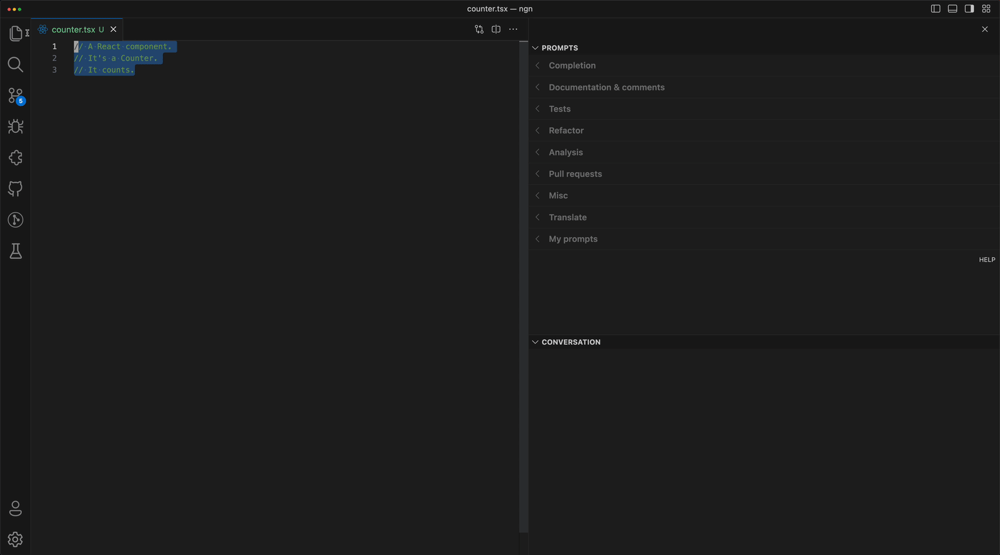
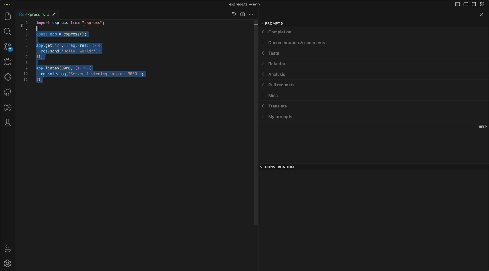
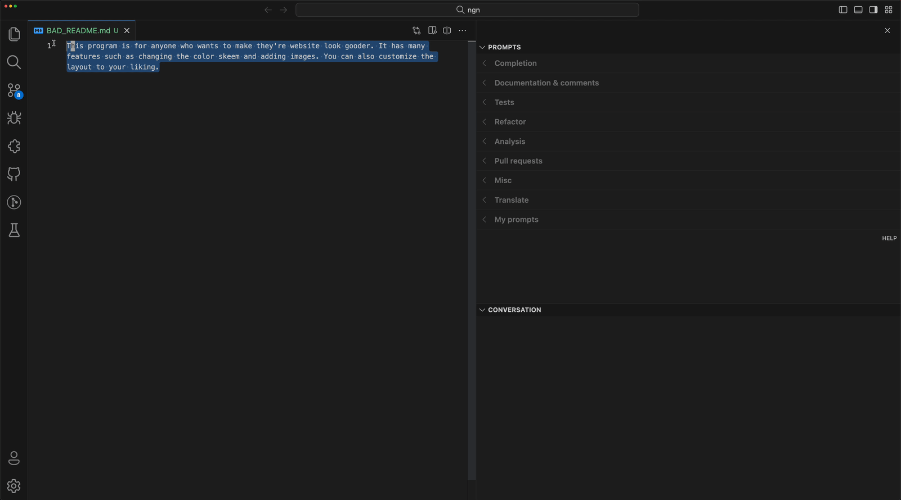

# wingman

A Visual Studio Code extension with ChatGPT (3.5 and 4), LLaMa or Claude integration with _**highly extensible and completely customizable prompting**_ templates. These are your prompts, with a few built-in defaults to get you started.

Wingman is and always will be free and open source. If you're enjoying it and find value in it, please consider [leaving a review](https://marketplace.visualstudio.com/items?itemName=nvms.ai-wingman&ssr=false#review-details) on the VSCode Marketplace to help give it exposure.

The extension is an attempt at delivering a modular tool that supports a broad spectrum of use cases. If you have a use case that isn't supported, and you think it might be a good fit for wingman, please let me know by opening an issue.

---

_**A quick note on using LLaMa-based models as a completion source:**_

Support for LLaMa-based models assumes that you're using an endpoint that mimics the OpenAI API. [https://github.com/go-skynet/LocalAI](LocalAI) is a good example of a tool that does this. Set `wingman.openai.apiBaseUrl` to your API URL (e.g. `http://localhost:1234/v1`) and `wingman.openai.model` to your desired model (e.g. `ggml-gpt4all-j`). Make sure your command's `provider` is set to `openai` (it is by default), and you're all set.

---

- [Demonstration](#demonstration)
  - [Comment-drive completion](#comment-drive-completion)
  - [Add documentation to what's selected](#add-documentation-to-whats-selected)
  - [Refactor: decompose and modularize](#refactor-decompose-and-modularize)
  - [Refactor: make it more functional](#refactor-make-it-more-functional)
  - [Refactor: input-driven modifications](#refactor-input-driven-modifications)
  - [Analysis: ask questions about your code](#analysis-ask-questions-about-your-code)
  - [Translations](#translations)
  - [Custom prompts](#custom-prompts)
- [Feedback](#feedback)
- [Quickstart](#quickstart)
- [Features](#features)
  - [String interpolations](#string-interpolations)
  - [Command](#command)
    - [Command properties](#command-properties)
    - [Example commands](#example-commands)
- [Context](#context)
  - [Text selection](#text-selection)
  - [Project text](#project-text)
    - [Configuring context inclusion and exclusion](#configuring-context-inclusion-and-exclusion)

---

⚠️ _Please note that this extension is currently under active development and its feature set is slowly evolving. As this happens, config property names may also be changed, and the way that commands are defined may also slightly change. I'll do my best to minimize this and preserve backward compatibility as much as possible._

## Demonstration

The majority of the prompts below are built-in, and can be used out-of-the-box. You can disable all of these by setting `wingman.showBuiltinCommands` to `false` in your settings.

It's really easy to create your own, and you are encouraged to do so.

#### Comment-drive completion

<center>



</center>

#### Add documentation to what's selected

<center>


</center>

#### Refactor: decompose and modularize

<center>


</center>

#### Refactor: make it more functional

<center>


</center>

#### Refactor: input-driven modifications

Select some code, click "Modify", and when prompted, enter the desired modifications. Wingman will replace the selected code with the newly generated code.

<center>


</center>

#### Analysis: ask questions about your code

<center>


</center>

#### Translations

Decide what language, framework, etc you want to translate the selected code into. In the below example, "python, using flask" is typed into the input field when prompted.

Try these:

- "typescript, using react and redux"
- "javascript, using vue and pinia"
- "go, using gin"
- "go, using martini and gorm"

<center>



</center>

#### Custom prompts

This is a custom prompt called "Reword README text". I use it when I'm drawing blanks. Like right now.

<center>



</center>

## Feedback

If you're enjoying the extension and find value in it, please let me know by leaving a review on the [VSCode Marketplace](https://marketplace.visualstudio.com/items?itemName=nvms.ai-wingman&ssr=false#review-details). It helps with the motivation to keep working on it.

If you have any feedback or suggestions for improvement, please open an issue. The extension is mostly built to cater to my own needs and workflow, but I'm trying to keep it as extensible as possible and may not have considered your use case.

## Quickstart

1. Install the extension.
2. Create an OpenAI account and get an API key (if you're using ChatGPT for generation).
3. Open the command palette (<kbd>CTRL + SHIFT + P</kbd> or <kbd>CMD + SHIFT + P</kbd>) and run `Wingman: Set API key`. Select `openai` as the provider and paste in your API key.
4. Open the bottom panel (<kbd>CTRL + J</kbd> or <kbd>CMD + J</kbd>) and select the `Wingman` tab (pictured above).
5. In the Wingman panel, expand "Analysis", highlight a block of code and click "Analyze for bugs".
6. Explore all of the other builtin commands.
7. Create your own commands that compliment your workflow in settings under `wingman.userCommands`. See the [Command](#command) section for more details.

## Features

- **User-defined commands** - Easily create your own commands with custom prompt templates.
- **Language-specific elaboration** - Use vscode's language identifier to define language-specific elaboration for your prompts. Add `{{language_instructions}}` to your templates, and then define the instructions for each language in your command's `languageInstructions` property. Here's an example:

  ````json
  {
    "command": "doc",
    "label": "Write documentation",
    "userMessageTemplate": "I have the following {{language}} code:\n```{{filetype}}\n{{text_selection}}\n```\n\nWrite really good documentation using best practices for the given language. Attention paid to documenting parameters, return types, any exceptions or errors. Don't change the code. {{language_instructions}} IMPORTANT: Only return the code inside of a code fence and nothing else.",
    "languageInstructions": {
      "cpp": "Use doxygen style comments for functions.",
      "java": "Use javadoc style comments for functions.",
      "typescript": "Use TSDoc style comments for functions.",
      "javascript": "Use JSDoc style comments for functions."
    },
    "callbackType": "replace",
    "provider": "openai",
    "category": "Documentation"
  }
  ````

- **Automatically replaces selected text** - OPTIONAL. If you have text selected, it will automatically replace it with the generated code block. This can be disabled or enabled per-command.
- **Continue the conversation** - After the model replies to your request, you can continue the conversation by using the input field below. Conversation context is preserved until you start a new request. This gives you the opportunity to follow-up on the models' response, e.g., "What happens if the second parameter is null or undefined?" or "Can you also add a test that ensures the method throws expectedly when given bad input?".
- **Elaboration/additional context** - OPTIONAL. If your command defines a `{{command_args}}` in its template, it will prompt you for elaboration on the command. This can be disabled or enabled per-command.
- **Configurable API url** - This is particularly useful if you're using something like [https://github.com/go-skynet/LocalAI](LocalAI), i.e. you want your wingman to be driven by a local LLaMa model.
- **Configurable model** - `gpt-3.5-turbo` or `gpt-4` are the two options currently available for ChatGPT. `gpt-3.5-turbo` is the default. This is a `string` field to allow for more flexibility, e.g. if you're using `LocalAI` and want to use a custom model like `ggml-gpt4all-j`.
- **Cancel requests** - Cancel an in-progress request.
- **String interpolation** - Use `{{language}}`, `{{command_args}}`, `{{text_selection}}`, `{{project_text}}`, `{{filetype}}`, and `{{language_instructions}}` in your templates (`userMessageTemplate` and `systemMessageTemplate` supported) to automatically fill in values.

### String interpolations

The table below lists some of the interpolations that you may have noticed in the example above. Wingman automatically replaces these interpolations for you, and the values they are replaced with are outlined in the table below. These interpolations can be utilized in both `userMessageTemplate` and `systemMessageTemplate`.

| Interpolation               | Description                                                                                                                              |
| --------------------------- | ---------------------------------------------------------------------------------------------------------------------------------------- |
| `{{language}}`              | The language identifier of the current file.                                                                                             |
| `{{command_args}}`          | The arguments passed to the command. When this is present, you will be prompted for additional input when the command button is clicked. |
| `{{text_selection}}`        | The selected text.                                                                                                                       |
| `{{project_text}}`          | Contents of all files in the opened project (all vscode workspace roots), using `.gitigore` and `.wmignore` as ignore patterns.          |
| `{{filetype}}`              | The file type of the current file. Not the extension name. Currently will have the same value as `{{language}}`.                         |
| `{{language_instructions}}` | The language-specific instructions for more generic commands, like the `doc` example above.                                              |

### Command

You can create your own commands by adding them to your settings under `wingman.userCommands`. Your commands need to implement the `Command` interface. Here's what the default, base command looks like:

```typescript
{
  // Required. Must be a unique string. Registers a vscode command as `wingman.<commandName>`.
  command: "default",
  // Required. Human readable label that appears in the UI.
  label: "Default",
  // Required. Your prompt, including any interpolations you need.
  userMessageTemplate: "",

  // Optional.
  systemMessageTemplate: "You are a {{language}} coding assistant.",
  // Optional.
  numberOfChoices: 1,
  // Optional.
  model: "gpt-3.5-turbo",
  // Optional.
  temperature: 0.3,
  // Optional.
  maxTokens: 4096,
  // Optional.
  // Possible values: "none", "buffer", "replace", "afterSelected", "beforeSelected"
  callbackType: CallbackType.None,
  // Optional. Used to replace {{language_instructions}} interpolation.
  languageInstructions: {
    javascript: "Use modern JavaScript syntax.",
    typescript: "Use modern TypeScript syntax.",
    cpp: "Use modern C++ features.",
    html: "Use modern HTML syntax.",
    csharp: "Use modern C# syntax.",
  },
  // Optional. Decides what category in the UI that this should appear under.
  category: "Default",
  // Optional.
  // Possible values: "openai", "anthropic"
  provider: "openai",
};
```

When you create your own command, you can override any of these properties. The only required properties are `command`, `label`, and `userMessageTemplate`.

#### Command properties

| Property                | Description                                                                                                                                                                                      |
| ----------------------- | ------------------------------------------------------------------------------------------------------------------------------------------------------------------------------------------------ |
| `model`                 | The model to use. Currently, only `gpt-3.5-turbo` and `gpt-4` are supported.                                                                                                                     |
| `numberOfChoices`       | See OpenAI API docs.                                                                                                                                                                             |
| `temperature`           | See OpenAI API docs.                                                                                                                                                                             |
| `command`               | The command name. This value is used to register the command with vscode: `wingman.<command>`.                                                                                                   |
| `label`                 | The label for the command to show in the UI.                                                                                                                                                     |
| `systemMessageTemplate` | See OpenAI API docs.                                                                                                                                                                             |
| `userMessageTemplate`   | The template for the user message. Automatically fills values for `{{language}}`, `{{command_args}}`, `{{text_selection}}`, `{{project_text}}`, `{{filetype}}`, and `{{language_instructions}}`. |
| `callbackType`          | The type of callback to use: `CallbackType.Buffer`, `CallbackType.Replace`, `CallbackType.AfterSelected`                                                                                         |
| `languageInstructions`  | A map of language identifiers to instructions for the given `userMessageTemplate`.                                                                                                               |
| `category`              | The category to place the command under in the UI.                                                                                                                                               |
| `provider`              | The provider used to handle this command request. `openai` or `anthropic`                                                                                                                        |

#### Example commands

Here are some more example commands.

````javascript
// settings.json

"wingman.userCommands": [
  {
    "command": "variableNames",
    "label": "Meaningful variable names",
    "userMessageTemplate":
      "I have the following {{language}} code:\n```{{filetype}}\n{{text_selection}}\n```\n\nGive the variables more meaningful names based on their usage. Return the refactored code inside of a code block and nothing else.",
    "callbackType": "replace",
    "category": "Refactoring"
  },
  {
    "command": "decompose",
    "label": "Decompose, modularize",
    "userMessageTemplate":
      "I have the following {{language}} code:\n```{{filetype}}\n{{text_selection}}\n```\n\nDecompose it by splitting functions, reducing responsibilities and enhancing modularity. Return the refactored code inside of a code block and nothing else.",
    "callbackType": "replace",
    "category": "Refactoring"
  },
  {
    "command": "comment",
    "label": "Comment",
    "userMessageTemplate":
      "I have the following {{language}} code:\n```{{filetype}}\n{{text_selection}}\n```\n\nWrite really good comments using best practices for the given language. Attention paid to documenting parameters, return types, any exceptions or errors. Don't change the code. Return only the comment inside of a code block and nothing else.",
    "callbackType": "beforeSelected",
    "category": "Comments"
  }
]
````

Ideally you'll create many commands that support your individual workflow, with prompts that are personalized to you and how you want to work.

<center>


</center>

## Context

Context is included in a `userMessageTemplate` by using either `{{text_selection}}` or `{{project_text}}`.

### Text selection

`{{text_selection}}` is a string interpolation that includes the currently selected text.

If you selected `const x = 1;` and your prompt was written as:

`I have the following code:\n\n{{text_selection}}\n\nWhat's wrong with it? `

Your final prompt would be:

`I have the following code:\n\nconst x = 1;\n\nWhat's wrong with it? `

### Project text

`{{project_text}}` is a string interpolation that includes the contents of all files in the current vscode workspace root. Each file is stringified and formatted as:

` // <filename>\n```<filetype>\n<file contents>\n```  `

If you had a file named `index.js` with the contents:

```javascript
import { add } from "./common/utils.js";
```

And a file named `common/utils.js` with the contents:

```javascript
export const add = (a, b) => a + b;
```

And your command prompt was:

`Suggest improvements to my {{language}} project:\n\n{{project_text}}`

Your final prompt would be:

```
Suggest improvements to my javascript project:

// file: src/index.js
\`\`\`javascript     <-- only escaped for the purposes of this README
import { add } from "./utils.js";
\`\`\`

// file: src/common/utils.js
\`\`\`javascript
export const add = (a, b) => a + b;
\`\`\`
```

This type of context inclusion can very quickly get out of hand, and you likely don't want to send tens of thousands of lines of code to whatever model you're using (at least not yet in 2023). For this reason, you are _highly encouraged_ to smartly configure the options below with values that make sense _for the project you are working on_.

Sensible defaults are provided for each of these configuration options, but these may not be applicable to all.

In most cases, the only option you'll be changing is `wingman.context.include.permittedFileExtensions`, as the other two likely won't change project-to-project.

If you wanted to ask your project a question only about the CSS styling of your app, then you might want to set `wingman.context.include.permittedFileExtensions` to `["css"]` before running your `projectQuestion` command. To set it back to its default value, just remove the entry from your `settings.json` entirely.

##### Configuring context inclusion and exclusion

| Config property                                   | Default                                                                                                                                                                                                              | Description                                                                            |
| ------------------------------------------------- | -------------------------------------------------------------------------------------------------------------------------------------------------------------------------------------------------------------------- | -------------------------------------------------------------------------------------- |
| `wingman.context.ignore.useGitignore`             | `true`                                                                                                                                                                                                               | Whether or not to use the `.gitignore` file to determine which files to ignore.        |
| `wingman.context.ignore.additionalIgnorePaths`    | `[ "**/node_modules/**", "**/dist/**", "**/out/**", "**/build/**", "**/media/**", "**/assets/**", "**/.github/**", "**/.vscode/**", "**/.vscode-test/**", "**/", "**/package.json", "**/.gitignore", "**/.git/**" ]` | Files matching any of these patterns in your workspace are also excluded from context. |
| `wingman.context.include.permittedFileExtensions` | `[ "js", "ts", "jsx", "tsx", "cpp", "py", "go", "java", "html", "css", "php", "rb", "cs", "swift", "kt", "scala", "h", "m", "mm", "c", "cc", "cxx", "hxx", "hpp", "hh", "s", "asm", "pl", "pm", "t", "r", "sh" ]`    | Only files with these extensions are included in context.                              |

If a `.wmignore` file is discovered, it's treated the same as a `.gitignore` file.

## FAQ

Q: How do I remove or change my API key?
A: Run the `Wingman: Set API key` command again, select the relevant provider. Paste in your new key, or leave it blank to remove it. Press enter.
