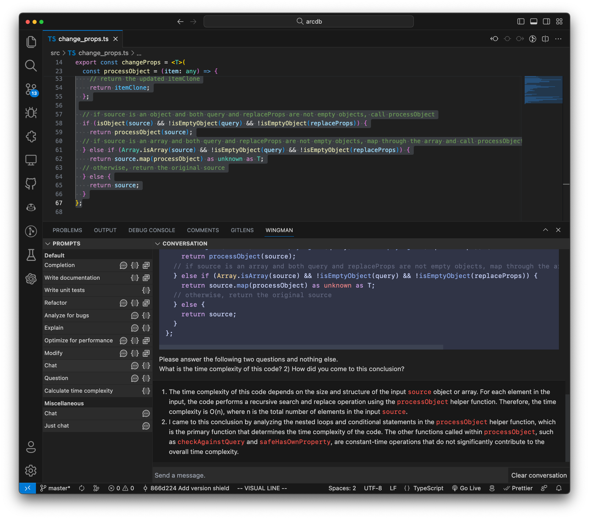

# wingman

A Visual Studio Code extension with ChatGPT integration with highly extensible and customizable prompting templates, and a number of defaults to get you started.

<center>



</center>

## Features

- **User-defined commands** - Easily create your own commands with custom prompt templates.
  
<center>


</center>

- **Language-specific elaboration** - Use vscode's language identifier to define language-specific elaboration. Add `{{language_instructions}}` to your templates:

  ```json
   {
    command: "doc",
    label: "Write documentation",
    userMessageTemplate:
      "I have the following {{language}} code:\n```{{filetype}}\n{{text_selection}}\n```\n\nWrite really good documentation using best practices for the given language. Attention paid to documenting parameters, return types, any exceptions or errors. Don't change the code. {{language_instructions}} IMPORTANT: Only return the code inside of a code fence and nothing else.",
    languageInstructions: {
      cpp: "Use doxygen style comments for functions.",
      java: "Use javadoc style comments for functions.",
      typescript: "Use TSDoc style comments for functions.",
      javascript: "Use JSDoc style comments for functions.",
    },
    callbackType: "replace",
    contextType: "selection"
  }
  ```

- **Automatically replaces selected text** - OPTIONAL. If you have text selected, it will automatically replace it with the generated code block. This can be disabled or enabled per-command.
- **Elaboration/additional context** - OPTIONAL. If your command defines a `{{commandArgs}}` in its template, it will prompt you for elaboration on the command. This can be disabled or enabled per-command.
- **Configurable API url** - This is particularly useful if you're using something like [https://github.com/go-skynet/LocalAI](LocalAI), i.e. you want your wingman to be driven by a local LLaMa model.
- **Configurable model** - `gpt-3.5-turbo` or `gpt-4` are the two options currently available. `gpt-3.5-turbo` is the default. This is currently an `enum` but will likely be changed to a `string` in the future to allow for more flexibility, e.g. if you're using `LocalAI` and want to use a custom model like `ggml-gpt4all-j`.
- **Cancel requests** - Cancel an in-progress request.

## Commands

| Command | Description |
| ------- | ----------- |
| Completion | Completes the selected text |
| Write documentation | Writes documentation for the selected text |
| Write unit tests | Writes unit tests for the selected text |
| Refactor | Refactors the selected code without changing its functionality, focusing on readability and maintainability |
| Analyze for bugs | Examines the selected code to alert you of possible bugs |
| Explain | Provides an explanation of the code |
| Optimize for performance | Attempt to optimize the selected code, considering performance, readability, etc. |
| Modify | Makes changes to the selected code |
| Chat | Communicate with team members about the selected code |
| Question | Asks a question about the selected code |
