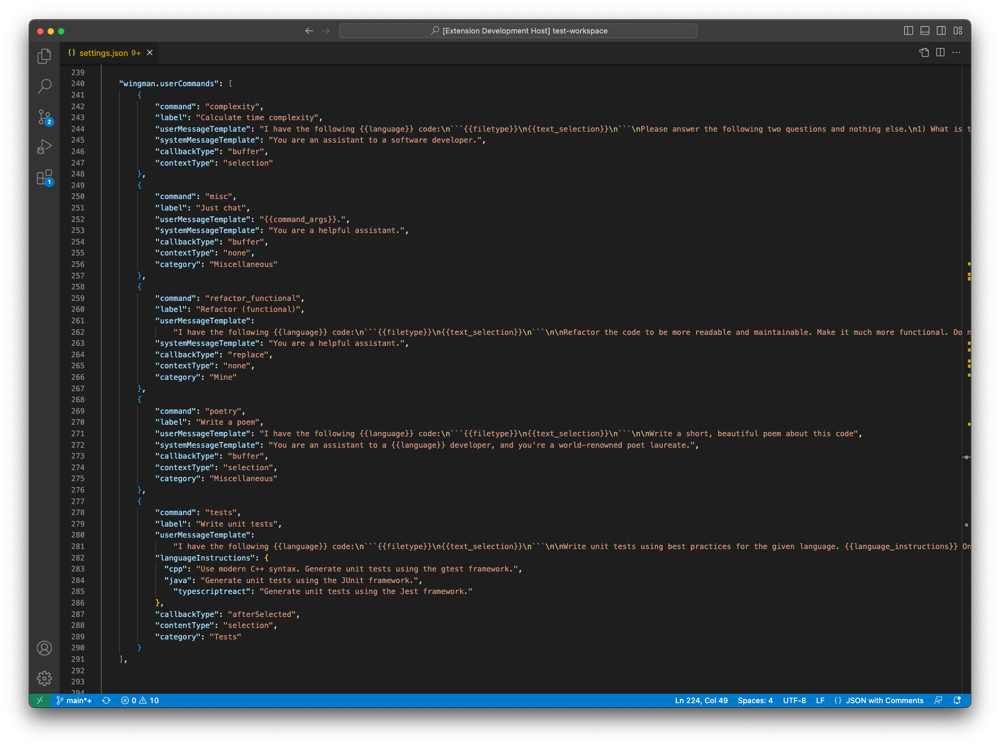

# wingman

A Visual Studio Code extension with ChatGPT (3.5 and 4), LLaMa or Claude integration with _**highly extensible and COMPLETELY CUSTOMIZABLE PROMPTING**_ templates. No magic. No shenanigans. These are your prompts, with a few built-in defaults to get you started.

To use a local LLaMa model for completely offline generation, set `wingman.openai.apiBaseUrl` to your local API URL and `wingman.openai.model` to your desired model. This works best with something like [https://github.com/go-skynet/LocalAI](LocalAI). Whatever API you choose to use just has to implement the same REST interface as the OpenAI API - _this is exactly what LocalAI does_.

_Please note that this extension is currently under active development and its feature set is slowly evolving. As this happens, config property names may also be changed, and the way that commands are defined may also slightly change. I'll do my best to minimize this and preserve backward compatibility as much as possible._

## Demo video

<center>

https://github.com/nvms/wingman/assets/17074357/c96a162d-7c56-4bac-9681-0873f77f387f

</center>

## Feedback

If you're enjoying the extension and find value in it, please let me know by leaving a review on the [VSCode Marketplace](https://marketplace.visualstudio.com/items?itemName=nvms.ai-wingman&ssr=false#review-details). It helps with the motivation to keep working on it.

If you have any feedback or suggestions for improvement, please open an issue. The extension is mostly built to cater to my own needs and workflow, but I'm trying to keep it as extensible as possible and may not have considered your use case.

## Quickstart

1. Install the extension.
2. Create an OpenAI account and get an API key (if you're using ChatGPT for generation).
3. Add your OpenAI API key to your settings under `wingman.openai.apiKey`: open Settings, search for "wingman", and paste your API key into the input field labeled "Api key".
4. Open VScode's bottom panel by pressing <kbd>CTRL + J</kbd> or <kbd>CMD + J</kbd> and select the `Wingman` tab (pictured above).
5. Highlight a block of code and click "Refactor" in the Wingman tab to refactor the selected code. The generated code will automatically replace the selected text.
6. Explore all of the other commands.
7. Write your other commands in your settings under `wingman.userCommands`. See the [Command interface](#command-interface) section for more details.

## Example commands

To really get the most out of this extension, you'll probably want to create your own commands. Here are some examples to get you started:

````javascript
// settings.json

"wingman.userCommands": [
  {
    "command": "variableNames",
    "label": "Meaningful variable names",
    "userMessageTemplate":
      "I have the following {{language}} code:\n```{{filetype}}\n{{text_selection}}\n```\n\nGive the variables more meaningful names based on their usage. Return the refactored code inside of a code block and nothing else.",
    "callbackType": "replace",
    "category": "Refactoring"
  },
  {
    "command": "decompose",
    "label": "Decompose, modularize",
    "userMessageTemplate":
      "I have the following {{language}} code:\n```{{filetype}}\n{{text_selection}}\n```\n\nDecompose it by splitting functions, reducing responsibilities and enhancing modularity. Return the refactored code inside of a code block and nothing else.",
    "callbackType": "replace",
    "category": "Refactoring"
  },
  {
    "command": "comment",
    "label": "Comment",
    "userMessageTemplate":
      "I have the following {{language}} code:\n```{{filetype}}\n{{text_selection}}\n```\n\nWrite really good comments using best practices for the given language. Attention paid to documenting parameters, return types, any exceptions or errors. Don't change the code. Return only the comment inside of a code block and nothing else.",
    "callbackType": "beforeSelected",
    "category": "Comments"
  }
]
````

## Features

- **User-defined commands** - Easily create your own commands with custom prompt templates.

<center>



</center>

- **Language-specific elaboration** - Use vscode's language identifier to define language-specific elaboration for your prompts. Add `{{language_instructions}}` to your templates, and then define the instructions for each language in your command's `languageInstructions` property. Here's an example:

  ````json
  {
    "command": "doc",
    "label": "Write documentation",
    "userMessageTemplate": "I have the following {{language}} code:\n```{{filetype}}\n{{text_selection}}\n```\n\nWrite really good documentation using best practices for the given language. Attention paid to documenting parameters, return types, any exceptions or errors. Don't change the code. {{language_instructions}} IMPORTANT: Only return the code inside of a code fence and nothing else.",
    "languageInstructions": {
      "cpp": "Use doxygen style comments for functions.",
      "java": "Use javadoc style comments for functions.",
      "typescript": "Use TSDoc style comments for functions.",
      "javascript": "Use JSDoc style comments for functions."
    },
    "callbackType": "replace",
    "provider": "openai",
    "category": "Documentation"
  }
  ````

- **Automatically replaces selected text** - OPTIONAL. If you have text selected, it will automatically replace it with the generated code block. This can be disabled or enabled per-command.
- **Continue the conversation** - After the model replies to your request, you can continue the conversation by using the input field below. Conversation context is preserved until you start a new request. This gives you the opportunity to follow-up on the models' response, e.g., "What happens if the second parameter is null or undefined?" or "Can you also add a test that ensures the method throws expectedly when given bad input?".
- **Elaboration/additional context** - OPTIONAL. If your command defines a `{{command_args}}` in its template, it will prompt you for elaboration on the command. This can be disabled or enabled per-command.
- **Configurable API url** - This is particularly useful if you're using something like [https://github.com/go-skynet/LocalAI](LocalAI), i.e. you want your wingman to be driven by a local LLaMa model.
- **Configurable model** - `gpt-3.5-turbo` or `gpt-4` are the two options currently available for ChatGPT. `gpt-3.5-turbo` is the default. This is a `string` field to allow for more flexibility, e.g. if you're using `LocalAI` and want to use a custom model like `ggml-gpt4all-j`.
- **Cancel requests** - Cancel an in-progress request.
- **String interpolation** - Use `{{language}}`, `{{command_args}}`, `{{text_selection}}`, `{{filetype}}`, and `{{language_instructions}}` in your templates (`userMessageTemplate` and `systemMessageTemplate` supported) to automatically fill in values.

## String interpolations

| Interpolation               | Description                                                                                                                              |
| --------------------------- | ---------------------------------------------------------------------------------------------------------------------------------------- |
| `{{language}}`              | The language identifier of the current file.                                                                                             |
| `{{command_args}}`          | The arguments passed to the command. When this is present, you will be prompted for additional input when the command button is clicked. |
| `{{text_selection}}`        | The selected text.                                                                                                                       |
| `{{project_text}}`          | Contents of all files in the opened project (all vscode workspace roots), using `.gitigore` and `.wmignore` as ignore patterns.          |
| `{{filetype}}`              | The file type of the current file. Not the extension name. Currently will have the same value as `{{language}}`.                         |
| `{{language_instructions}}` | The language-specific instructions for more generic commands, like the `doc` example above.                                              |

## Command interface

You can create your own commands by adding them to your settings under `wingman.userCommands`. Your commands need to implement the `Command` interface:

```typescript
export interface Command {
  model?: string;
  temperature?: number;
  numberOfChoices?: number;
  command: string;
  label: string;
  userMessageTemplate: string;
  systemMessageTemplate?: string;
  languageInstructions?: {
    [languageId: string]: string;
  };
  callbackType?: CallbackType;
  category?: string;
  provider?: "openai" | "anthropic";
}
```

This is what the default, base command looks like:

```typescript
export const baseCommand: Command = {
  numberOfChoices: 1,
  model: "gpt-3.5-turbo",
  temperature: 0.8,
  command: "default",
  label: "Default",
  systemMessageTemplate: "You are a {{language}} coding assistant.",
  userMessageTemplate: "",
  callbackType: CallbackType.Buffer,
  languageInstructions: {
    javascript: "Use modern JavaScript syntax.",
    typescript: "Use modern TypeScript syntax.",
    cpp: "Use modern C++ features.",
    html: "Use modern HTML syntax.",
    csharp: "Use modern C# syntax.",
  },
  category: "Default",
  provider: "openai",
};
```

When you create your own command, you can override any of these properties. The only required properties are `command`, `label`, and `userMessageTemplate`.

## Command properties

| Property                | Description                                                                                                                                                                                      |
| ----------------------- | ------------------------------------------------------------------------------------------------------------------------------------------------------------------------------------------------ |
| `model`                 | The model to use. Currently, only `gpt-3.5-turbo` and `gpt-4` are supported.                                                                                                                     |
| `maxTokens`             | See OpenAI API docs.                                                                                                                                                                             |
| `numberOfChoices`       | See OpenAI API docs.                                                                                                                                                                             |
| `temperature`           | See OpenAI API docs.                                                                                                                                                                             |
| `command`               | The command name. This value is used to register the command with vscode: `wingman.<command>`.                                                                                                   |
| `label`                 | The label for the command to show in the UI.                                                                                                                                                     |
| `systemMessageTemplate` | See OpenAI API docs.                                                                                                                                                                             |
| `userMessageTemplate`   | The template for the user message. Automatically fills values for `{{language}}`, `{{command_args}}`, `{{text_selection}}`, `{{project_text}}`, `{{filetype}}`, and `{{language_instructions}}`. |
| `callbackType`          | The type of callback to use: `CallbackType.Buffer`, `CallbackType.Replace`, `CallbackType.AfterSelected`                                                                                         |
| `languageInstructions`  | A map of language identifiers to instructions for the given `userMessageTemplate`.                                                                                                               |
| `category`              | The category to place the command under in the UI.                                                                                                                                               |
| `provider`              | The provider to use for the generation of this command.                                                                                                                                          |

## Context

### Interpolations

#### Selected text

`{{text_selection}}` is a string interpolation that includes the currently selected text.

If you selected `const x = 1;` and your prompt was written as:

`I have the following code:\n\n{{text_selection}}\n\nWhat's wrong with it? `

Your final prompt would be:

`I have the following code:\n\nconst x = 1;\n\nWhat's wrong with it? `

#### Project text

`{{project_text}}` is a string interpolation that includes the contents of all files in the current vscode workspace root. Each file is stringified and formatted as:

` // <filename>\n```<filetype>\n<file contents>\n```  `

If you had a file named `index.js` with the contents:

```javascript
import { add } from "./common/utils.js";
```

And a file named `common/utils.js` with the contents:

```javascript
export const add = (a, b) => a + b;
```

And your command prompt was:

`Suggest improvements to my {{language}} project:\n\n{{project_text}}`

Your final prompt would be:

```
Suggest improvements to my javascript project:

// file: src/index.js
\`\`\`javascript     <-- only escaped for the purposes of this README
import { add } from "./utils.js";
\`\`\`

// file: src/common/utils.js
\`\`\`javascript
export const add = (a, b) => a + b;
\`\`\`
```

### Configuring context inclusion and exclusion

| Config property                                   | Default                                                                                                                                                                                                              | Description                                                                            |
| ------------------------------------------------- | -------------------------------------------------------------------------------------------------------------------------------------------------------------------------------------------------------------------- | -------------------------------------------------------------------------------------- |
| `wingman.context.ignore.useGitignore`             | `true`                                                                                                                                                                                                               | Whether or not to use the `.gitignore` file to determine which files to ignore.        |
| `wingman.context.ignore.additionalIgnorePaths`    | `[ "**/node_modules/**", "**/dist/**", "**/out/**", "**/build/**", "**/media/**", "**/assets/**", "**/.github/**", "**/.vscode/**", "**/.vscode-test/**", "**/", "**/package.json", "**/.gitignore", "**/.git/**" ]` | Files matching any of these patterns in your workspace are also excluded from context. |
| `wingman.context.include.permittedFileExtensions` | `[ "js", "ts", "jsx", "tsx", "cpp", "py", "go", "java", "html", "css", "php", "rb", "cs", "swift", "kt", "scala", "h", "m", "mm", "c", "cc", "cxx", "hxx", "hpp", "hh", "s", "asm", "pl", "pm", "t", "r", "sh" ]`    | Only files with these extensions are included in context.                              |

If a `.wmignore` file is discovered, it's treated the same as a `.gitignore` file.
