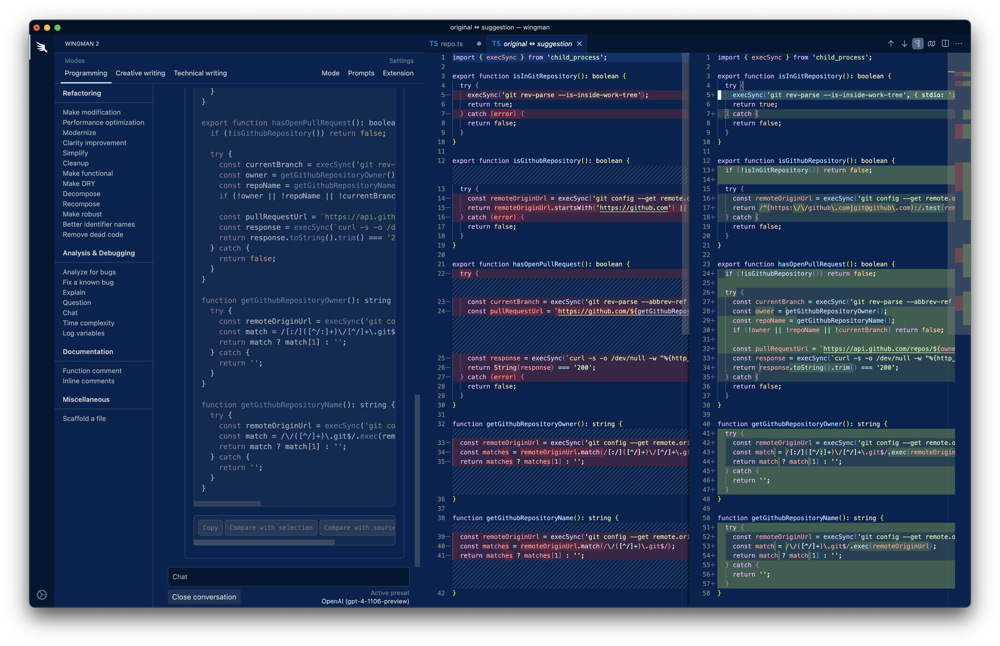
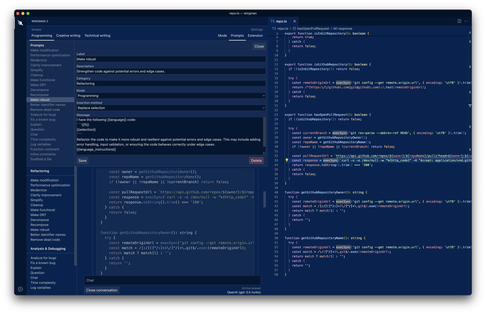
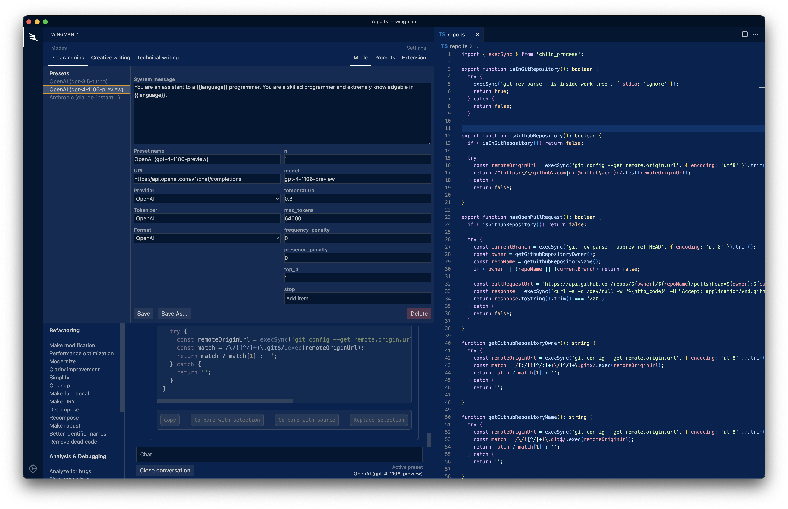
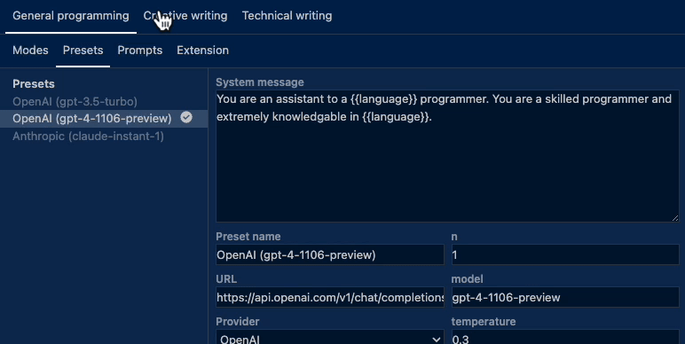

A highly flexible, customizable, and powerful extension for working with LLMs within Visual Studio Code.

Highlights:

- Compatible with OpenAI (any model), Anthropic (any model), KoboldCpp (soon!) — and any API following the same request/response pattern. Do you self-host an inference server and LLM? You will love Wingman.
- Complete control over completion parameters, system message, and more.
- Highly customizable prompt templates with built-in prompt management.
- Workspace-specific chat history storage. Review old chats whenever.
- No need to edit `settings.json` for any reason. There's a UI for everything.
- A few modes, and dozens of prompts to get you started.

# Usage

If you're using a local solution, you can skip setting an API key.

Otherwise, you need to configure API keys for whichever providers you plan to use by opening the command pallete (Windows: <kbd>⊞</kbd><kbd>⇧</kbd><kbd>P</kbd>, macOS: <kbd>⌘</kbd><kbd>⇧</kbd><kbd>P</kbd>) and running the command labeled: "Wingman: Set API key". Select the provider you want to use, enter your API key, and press enter.

# Core concepts

There are three concepts that are crucial to understanding how Wingman operates.

It's really not that complicated.

- Prompts
- Presets
- Modes

## Prompts

A UI is included for prompt management.

Wingman makes your prompts dynamic with support for placeholders.

Current placeholders:

- `{{selection}}` is replaced with the selected text.
- `{{ft}}` is replaced with the VSCode language identifier (`go`, `typescript`)
- `{{language}}` is replaced with a friendly language name (`Go`, `TypeScript`).
- `{{file}}` is replaced with the contents of the active file.
- `{{input}}` prompts for user input and replaces this placeholder with the response.
- `{{:param:val}}` prompt-level completion param overrides (e.g. `{{:top_k:0.1}}`).

## Presets

A UI is included for preset management.

A preset is a provider configuration. It defines the system message, the provider, the API URL, and completion parameters. You can create as many presets as you want and switch between them whenever.

## Modes

A UI is included for preset management.

Modes enhance the prompt and preset management experience. A mode is a collection of presets and prompts. Three built-in modes are provided as examples: "Programming", "Creative writing", and "Technical writing", but you are encouraged to create your own.

Modes can have presets assigned to them. Here's why this is useful:

- Your "Programming" mode can use your GPT-4-Turbo preset.
- Your "Creative writing" mode can use your Anthropic Claude preset.
- And so on, and so forth.

Switching between modes automatically activates the last preset used in that mode.

# Development

1. In `/webview`: `npm run dev`. This is a Svelte project that outputs to `/extension/dist`.
2. In `/extension`: `npm run build:watch`
3. Run the extension using the debug panel.

# TODO

- UI for configuring `{{language_instructions}}`.
- Continue archived conversations.